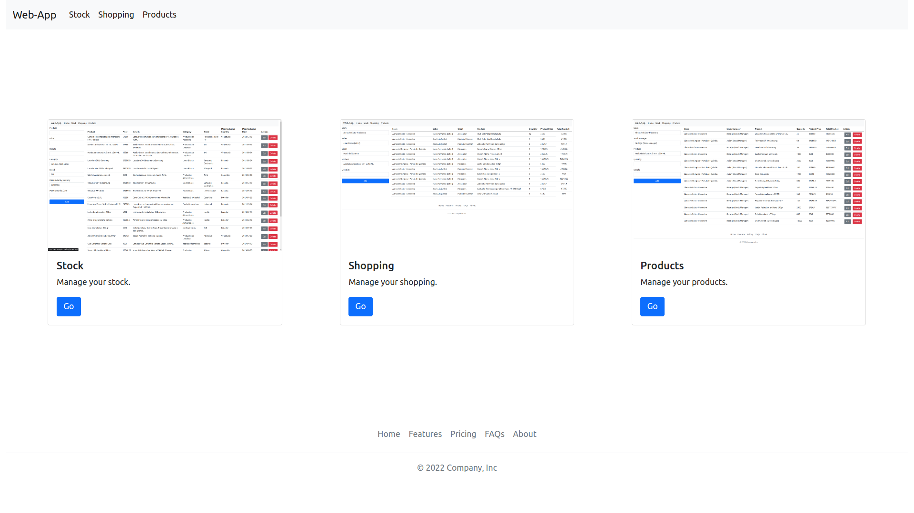
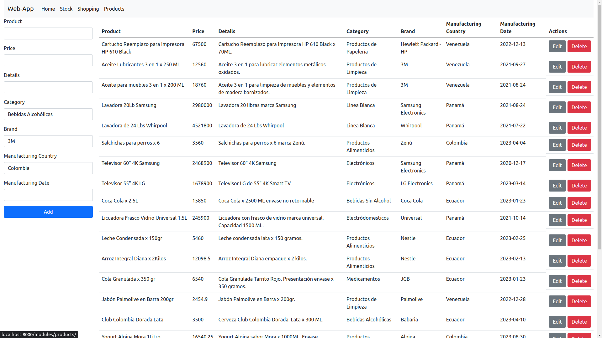
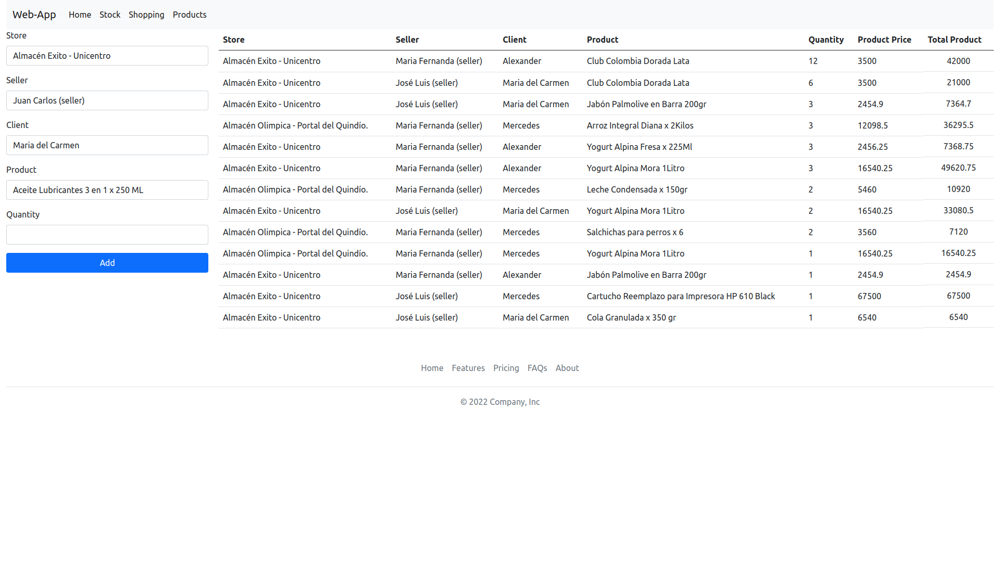
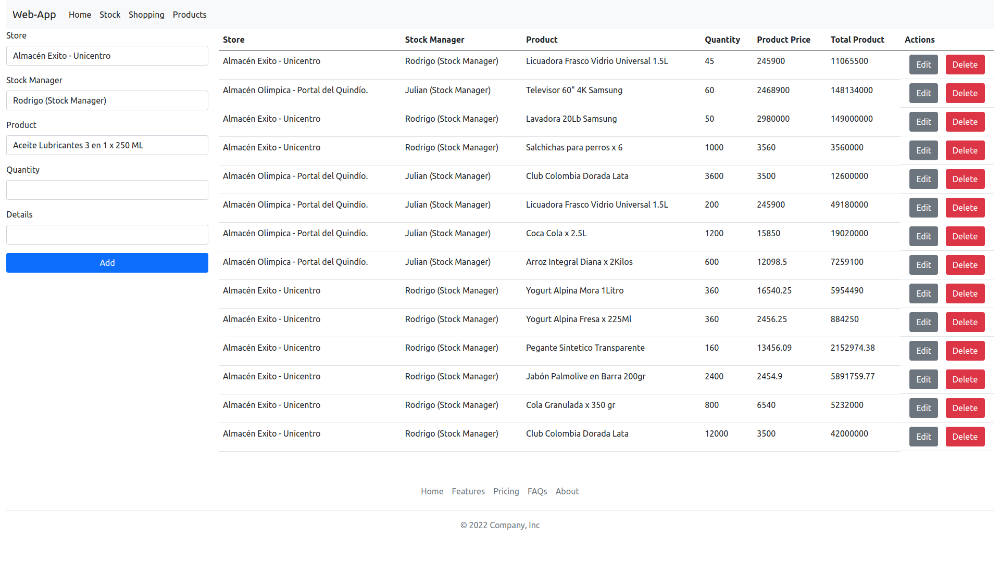
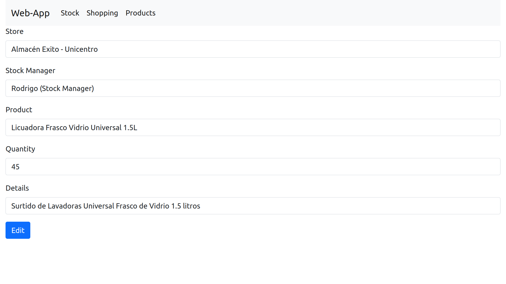

# FINAL PROJECT

## Description

The objective is to create a web application mainly with PHP and SQL to manage the CRUD of the following modules: Stock, Shopping and Products.
> [!NOTE]
> To enhance the user experience, it is highly recommended to incorporate **AJAX**. This will allow for seamless data updates without requiring page refreshes. I plan to implementat this feature later.

## Overview

- Home
  
- Stock
  
- Shopping
  
- Products
  
- Edit Example (Products)
  

> [!NOTE]
> Each CRUD view is dynamically generated by the Controller class. This provides a consistent interface and **reduces the amount of repetitive code**. For a deeper understanding of how this works, see: [controller.php](controllers/controller.php).

## Setup

1. Update the [config.php](config/config.php) file according to your requirements.

2. Create a database named after the $db_name variable in the [db.php](config/config.php) file. By default, it is named `eam_20232final`.

   ```bash
   mysql -u <user> -p -e "CREATE DATABASE eam_20232final"
   ```

3. Import the [db_final.sql](db_final.sql) database file.

   ```bash
   mysql -u <user> -p eam_20232final < db_final.sql
   ```

## Run

To run the application, execute the following command from the root of the project.

```bash
php -S localhost:8000
```

Then, open your web browser and navigate to the following URL: http://localhost:8000
